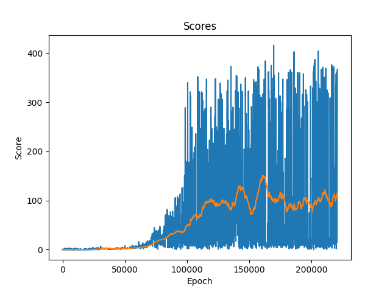
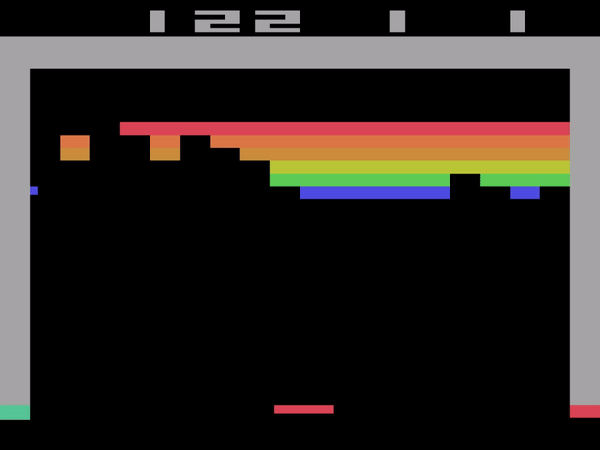

# DQN Reinforcement Learning in Atari Games


## Introduction
A DQN, or Deep Q-Network, approximates a state-value function in a Q-Learning framework with a neural network. In the Atari Games case, they take in several frames of the game as an input and output state values for each action as an output.

It is usually used in conjunction with Experience Replay, for storing the episode steps in memory for off-policy learning, where samples are drawn from the replay memory at random. Additionally, the Q-Network is usually optimized towards a frozen target network that is periodically updated with the latest weights every k steps (where k is a hyperparameter). The latter makes training more stable by preventing short-term oscillations from a moving target. The former tackles autocorrelation that would occur from on-line learning, and having a replay memory makes the problem more like a supervised learning problem.


## The Game
**Breakout** is a classic arcade video game that was first released by Atari in 1976. It is a simple yet challenging game that has become a popular choice for testing and developing reinforcement learning algorithms. The game's objective is to break a wall of bricks using a paddle and ball, which bounces off the walls and obstacles.


### Objective
The primary objective of the Breakout game is to clear the screen of all the bricks. Players control a paddle located at the bottom of the screen, which can be moved left and right. A ball is launched from the paddle, and it bounces around the screen, colliding with bricks. The player must move the paddle to ensure that the ball doesn't fall off the screen. When the ball strikes a brick, the brick disappears, and the player scores points. The game continues until all the bricks are removed or the player loses all their lives.

### Complexity
While the concept of the Breakout game is straightforward, it presents several challenges for AI agents, particularly when using reinforcement learning. These challenges include:
 - **High-Dimensional State Space**: The game is typically played using pixel-based graphics, resulting in a high-dimensional state space that the AI agent must interpret. This makes learning an optimal policy more challenging.
 - **Sparse Rewards**: The rewards in Breakout are sparse, as they are primarily obtained by breaking bricks. It can take a significant number of actions to achieve a meaningful reward signal.
 - **Exploration vs. Exploitation**: Agents must strike a balance between exploring different actions to discover the best strategy and exploiting actions that have yielded positive results.
 - **Temporal Credit Assignment**: Determining which actions contributed to a successful or unsuccessful outcome is challenging due to the delayed nature of rewards in the game.


## DQN Algorithm
**Deep Q-Network (DQN)** is a deep reinforcement learning algorithm that combines neural networks with Q-learning to enable agents to make decisions in complex and high-dimensional environments. It was introduced by Volodymyr Mnih et al. in their 2015 paper "Human-level control through deep reinforcement learning."

### Components of the DQN Algorithm
- **Q-Network**: The core of the DQN is a neural network, often a deep convolutional neural network (CNN). This network is responsible for approximating the Q-function, denoted as Q(s, a), which estimates the expected cumulative reward of taking action 'a' in state 's'. The Q-network takes the current state as input and outputs Q-values for all possible actions.
- **Experience Replay**: DQN uses an experience replay buffer, which is a storage of past experiences (state, action, reward, next state). This buffer helps in breaking the temporal correlation of sequential experiences, making training more stable. During training, random batches of experiences are sampled from the replay buffer for updates. More details are presented below.
- **Target Network**: To stabilize training, DQN employs two networks: the primary Q-network and a target network. The target network is a copy of the Q-network but with frozen parameters. The Q-network is periodically synchronized with the target network. This technique helps prevent the target Q-values from "moving" during training, improving stability.

### Q-Learning Update Equation
The core of the DQN algorithm is the Q-learning update equation, which is used to iteratively update the Q-values. It is based on the temporal difference (TD) error:

$$ Q(s, a) = Q(s, a) + \alpha * [r + \gamma * max(Q(s', a')) - Q(s, a)] $$

- $Q(s, a)$ is the Q-value for taking action $a$ in state $s$.
- $\alpha$ is the learning rate, determining the step size for the updates.
- $r$ is the immediate reward obtained after taking action $a$ in state $s$.
- $\gamma$ is the discount factor, which weights future rewards.
- $max(Q(s', a'))$ represents the maximum Q-value for the next state $s$ considering all possible actions $a$.

### Training
 - **Initialization**: The Q-network and the target network are initialized with random weights. The experience replay buffer is also initialized.
 - **Exploration vs. Exploitation**: During training, the agent must balance exploration (trying new actions) and exploitation (choosing the best-known actions). This balance is often achieved using an ε-greedy policy, where the agent selects the best-known action with probability 1-ε and explores with probability ε.
 - **Experience Collection**: The agent interacts with the environment, collecting experiences in the form of (state, action, reward, next state).
 - **Experience Replay**: Periodically, a random batch of experiences is sampled from the replay buffer, and the Q-network is updated using the Q-learning update equation.
 - **Target Network Update**: The target network is updated to match the Q-network periodically to stabilize training.
 - **Convergence**: Training continues until the Q-values start converging towards the optimal values.


## Project Implementation

### Preprocessing
To make the training process less memory-intensive I had to crop the original frame by excluding useless pixels that provided no useful information (such as the score and remaining lives at the top of the screen). Then, the image is resized to an 84x84 square and grayscaled (the colors of each brick have no meaning). The last preprocessing step was adding shadows representing the direction of the ball and the paddle. This was made by taking two subsequent frames and subtracting the older frame (set darker) from the newer one. You can see an example in the image below.


### The Network
Let's break down the structure of the neural network.
Convolutional Layers
 - The first convolutional layer takes input with 1 channel (the image is grayscaled after the preprocessing) and applies 32 filters of size 8x8 with a stride of 4 and padding of 2.
 - The second convolutional layer uses 64 filters of size 4x4 with a stride of 2 and padding of 1.
 - The third convolutional layer uses 64 filters of size 3x3 with a stride of 1 and padding of 1.
 - ReLU activation functions follow each convolutional layer.

Fully Connected Layers
 - The output from the convolutional layers is flattened to a one-dimensional tensor.
 - The first fully connected layer takes the flattened input and produces an output with 512 units, followed by a ReLU activation.
 - The second fully connected layer produces the final output with 4 units, representing the Q-values for each possible action.


### Experience Replay
The core idea behind experience replay is to store and randomly sample experiences from the agent's past interactions with the environment, creating a replay buffer. These experiences (state, action, reward, next state) are then used for training the neural network, breaking the temporal correlation between consecutive experiences. Here's how experience replay is employed to stabilize training:

 - Replay Buffer Initialization: A replay buffer is initialized with a fixed capacity. This buffer stores past experiences, and its capacity determines how many experiences are retained at any given time.
 - Experience Collection: During each interaction with the environment, the agent collects experiences (state, action, reward, next state) and adds them to the replay buffer.
 - Random Sampling: Instead of using the most recent experiences immediately for training, the agent samples a random batch of experiences from the replay buffer. This random sampling helps in breaking the temporal correlation between consecutive experiences.
 - Training with Experience Replay: The sampled batch of experiences is used to update the parameters of the Q-network. The Q-network is trained to minimize the temporal difference (TD) error, which measures the difference between the predicted Q-values and the target Q-values.
 - Batch Learning: By training on batches of experiences rather than individual experiences, the learning process becomes more stable. This is because the network is updated with a variety of experiences, which helps prevent it from focusing too much on the most recent data.

Benefits of Experience Replay:
 - Sample Efficiency: Reusing past experiences allows the agent to learn more from each experience, making training more sample-efficient.
 - Stability: Training on random batches of experiences reduces the risk of the model overfitting to the most recent experiences or getting stuck in local minima.
 - Breaking Correlation: The random sampling breaks the temporal correlation between consecutive experiences, which can help stabilize learning and prevent oscillations.
 - Diverse Training Data: The replay buffer contains a diverse set of experiences, ensuring that the training data covers a wide range of situations the agent may encounter.


## Training and Results
The choosen hyperparameters are:
``` 
BATCH_SIZE = 128 # the number of random transitions sampled from the replay buffer
GAMMA = 0.99 # the discount factor as mentioned in the previous section
EPS_START = 0.9 # the starting value of epsilon
EPS_END = 0.05 # the final value of epsilon
EPS_DECAY = 0.99 # the rate of exponential decay of epsilon, closer to one means a slower decay
TAU = 0.005 # the update rate of the target network
LR = 1e-4 # the learning rate of the ``Adam`` optimizer
REPLACE_TARGET_EVERY_K_STEPS = 5_000 # Updates the target net to have same weights as policy net
STEPS = 200_000 # number of games to play
``` 
The only metric used to evaluate the results was the ending score of the game. Higher the score, better was the agent.
To prevent a model to keep playing indefinitely without firing a new ball, the game had a timeout.  



Here we have 3 versions of the model after 50.000, 100.000 and 169.700 epochs of training.
As you can see, the last one is definitely better than the other two.
The most surprising improvment was the ability of the model to make a tunnel between the brick to
push the ball above the layer of bricks and keep removing brick without risk to lose the ball.





## Possible Improvements
The main improvment is to use the duration of a game as part of the model evaluation, because lot of models got stuck in the same pattern of moves that prevented loosing the ball but was not improving their score.